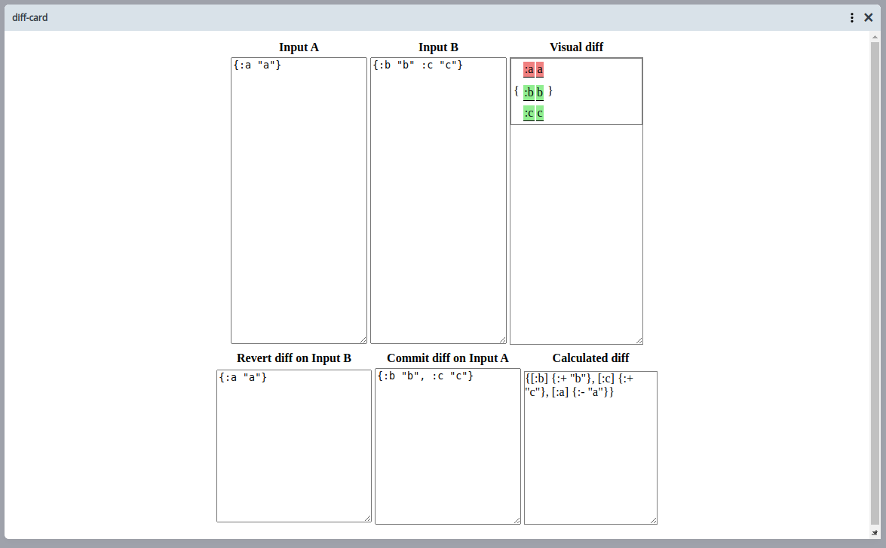

# Test task for RoamResearch (RR)

This project is a test task to implements a diff algorithm, it works with some **Clojure/Script** data-structures, these are:

- Vectors, e.g. `[1 2 3 4]`.
- Maps, e.g. `{:key "value"}`.

The project was developed to be used mainly with ClojureScript, but some namespaces were wrote with `cljc` extension for [portable files in multiple Clojure platforms](https://clojure.org/reference/reader#_reader_conditionals)

## Contents

- [What?](#what)
- [Installation](#installation)
- [Usage](#usage)
- [How to add more tests?](#how-to-add-more-tests)

---

### What?

It is a project to show the capability of Flexiana to potential customer.

- Make use of the algorithm to show differences between two inputs, that's it using the GUI (frontend interface).
- Make use of the algorithm to test the differences between two sources of code, that's it using data from RoamResearch API.

---

### Installation

If you are using macOS or Linux the only dependencies required for this project are:

- Yarn (package manager).
- NodeJS (JavaScript runtime).
- Clojure (programming language).

Then you can run `yarn` to install dependencies, later you can run some environment:

- `yarn serve` to show the GUI in the browser (opens http://localhost:8080).
- `yarn test` to run the test directory (it contains tests that prove diff algorithm with some data).
- `yarn repl` to run repl environment with shadow-cljs.

---

### Usage

You can use the GUI to prove the diff algorithm, such that image shown:


Also you can add a new test within test directory. The data-structure map test uses `map-commit`, `map-revert` and `map-diff` functions from `map-diff` namespace.

---

### How to add more tests?

- Getting data from RR-API. You can get data from a RR account using the console, moreover it uses datalog/datomic schema, but it returns data in valid JSON. To get more information click [here](https://www.putyourleftfoot.in/introduction-to-the-roam-alpha-api) and [here](https://davidbieber.com/snippets/2020-12-22-datalog-queries-for-roam-research/).
- Escape especial characters from RR-API answer, indeed it should be stringified to **Clojure/Script** to be translated by `roam-research/->clj` function as follows:

```clojure
(rr/->clj "{\":block/uid\": \"OtQdkIAKn\",
            \":block/page\": { \":db/id\": 3 },
            \":edit/user\": { \":db/id\": 1 },
            \":db/id\": 4}")
```

- Finally, add some test within test directory using `cljs.test` and `clojure.test` (remembers that this project uses `cljc` extension long way down) in a mix of functions from `map-diff` namespace.

---

### Complex test cases

In the next 

```javascript
let page = window.roamAlphaAPI.pull("[*]", 262);

let fullPage = {
  ...page,
  ":block/children": page[":block/children"].map((id) =>
    window.roamAlphaAPI.pull("[*]", id[":db/id"])
  ),
};

JSON.stringify(fullPage);
```
